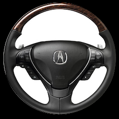
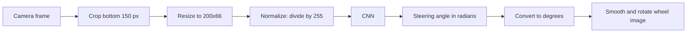

<div align="center">

# 🚗 Autonomous Car: Steering Angle Prediction with Deep Learning

**A CNN that looks at a car's front-camera image and predicts how much to turn the steering wheel.**


-FF6F00?logo=tensorflow&logoColor=white)




🎥 **[Watch the demo](model_running_preview_RajanSingh.mp4)**

</div>

---

## 📑 Table of Contents

1. [About the Project](#-about-the-project)
2. [Key Features](#-key-features)
3. [How It Works](#-how-it-works)
4. [Model Architecture](#-model-architecture)
5. [Dataset](#-dataset)
6. [Project Structure](#-project-structure)
7. [Getting Started](#-getting-started)
8. [Usage](#-usage)
9. [Training Configuration](#-training-configuration)
10. [Scope and Limitations](#-scope-and-limitations)
11. [Roadmap](#-roadmap)
12. [Troubleshooting](#-troubleshooting)
13. [Acknowledgements](#-acknowledgements)
14. [License](#-license)

---

## 📖 About the Project

Computer vision lets machines understand images and video. In self-driving, it acts as the car's eyes.

This project uses **end-to-end learning** (also called *behavior cloning*): instead of hand-coding rules for lane lines and curves, a **Convolutional Neural Network (CNN)** learns directly from about **63,000 real driving frames**, each paired with the steering angle a human driver used. After training, the model predicts a steering angle for images it has never seen.

The architecture follows NVIDIA's paper [*End to End Learning for Self-Driving Cars*](https://arxiv.org/abs/1604.07316) (Bojarski et al., 2016).

## ✨ Key Features

- 🧠 **NVIDIA PilotNet-style CNN** with 5 convolutional and 4 dense layers (~1.6M parameters)
- 🗂️ **Complete data pipeline:** label parsing, cropping, resizing, normalization, shuffling, 80/20 train/validation split, batching
- 🏋️ **Training with regularization:** dropout and L2 penalty to reduce overfitting
- 📊 **TensorBoard logging** of the loss during training
- 🎮 **Live visualization:** a steering wheel image rotates according to the prediction, with smoothing for natural movement
- 🖼️ **Two inference modes:** replay dataset frames, or use a live webcam

## ⚙️ How It Works



1. **Crop:** keep only the bottom 150 pixels (the road) and drop the sky and background.
2. **Resize and normalize:** shrink to 200×66 and scale pixel values to 0–1 for faster, stabler training.
3. **Predict:** the CNN turns the image into a single steering value.
4. **Visualize:** the angle is smoothed and used to rotate the steering wheel image.

**Labels:** the dataset stores angles in degrees. They are converted to radians for training and back to degrees for display. Steering angle is used instead of the paper's inverse turning radius because the two are proportional.

## 🧠 Model Architecture

Input: `66 × 200 × 3` (RGB image)

| # | Layer | Filters / Units | Kernel | Stride | Activation |
|:-:|-------|:---------------:|:------:|:------:|:----------:|
| 1 | Conv2D | 24 | 5×5 | 2 | ReLU |
| 2 | Conv2D | 36 | 5×5 | 2 | ReLU |
| 3 | Conv2D | 48 | 5×5 | 2 | ReLU |
| 4 | Conv2D | 64 | 3×3 | 1 | ReLU |
| 5 | Conv2D | 64 | 3×3 | 1 | ReLU |
|  | Flatten | 1152 | | | |
| 6 | Dense + Dropout | 1164 | | | ReLU |
| 7 | Dense + Dropout | 100 | | | ReLU |
| 8 | Dense + Dropout | 50 | | | ReLU |
| 9 | Dense + Dropout | 10 | | | ReLU |
| 10 | Dense (output) | 1 | | | 2 · atan(x) |

- **Convolutions** detect patterns: edges first, then lane lines and road curvature.
- **Dense layers** combine those patterns into a steering decision.
- **`2 · atan(x)`** keeps the output in roughly ±π radians (±180°), so predictions stay in a sensible steering range.
- All convolutions use `VALID` padding, and the weights use a truncated normal initialization (stddev 0.1).

## 📦 Dataset

The model uses open driving datasets recorded around **Rancho Palos Verdes and San Pedro, California**, originally collected by [Sully Chen](https://github.com/SullyChen/driving-datasets).

| Dataset | Size | Images | Label format |
|---------|:----:|:------:|--------------|
| **Main dataset** | ~3.1 GB | ~63,000 | `filename.jpg angle,year-mm-dd hr:min:sec:millisec` |
| **Dataset 1** (original, 2017) | ~2.2 GB | ~45,500 | `filename.jpg angle` |

📥 [Download main dataset](https://drive.google.com/open?id=1PZWa6H0i1PCH9zuYcIh5Ouk_p-9Gh58B) &nbsp;|&nbsp; 📥 [Download Dataset 1](https://drive.google.com/file/d/1Ue4XohCOV5YXy57S_5tDfCVqzLr101M7/view?usp=sharing)

Extract the images into a folder named **`driving_dataset/`**, next to the code. It must contain a `data.txt` file with one `filename angle` pair per line.

> ⚠️ `driving_data.py` reads the first two space-separated fields of each line. If a line looks like `123.jpg 4.5,2017-...`, make sure the angle is a clean number (for example, strip the timestamp from `data.txt`).

## 🗂️ Project Structure

```
autonomous-car/
├── driving_dataset/            # images + data.txt (download separately)
├── save/                       # trained model (checkpoint files)
│   ├── checkpoint
│   ├── model.ckpt.data-00000-of-00001
│   ├── model.ckpt.index
│   └── model.ckpt.meta
├── logs/                       # TensorBoard event files
├── driving_data.py             # data loading, splitting, batching
├── model.py                    # CNN architecture
├── train.py                    # training loop
├── run_dataset.py              # inference on dataset images
├── run.py                      # inference on a live webcam
├── steering_wheel_image.jpg    # image rotated to show predictions
├── Running_Preview.mp4         # demo video
└── README.md
```

## 🚀 Getting Started

### Prerequisites

- Python 3.8–3.11
- A GPU is optional but speeds up training a lot

### Installation

```bash
# 1. Clone the repository
git clone https://github.com/<your-username>/<your-repo>.git
cd <your-repo>

# 2. Create a virtual environment (recommended)
python -m venv venv
source venv/bin/activate          # Windows: venv\Scripts\activate

# 3. Install dependencies
pip install tensorflow opencv-python numpy scipy
```

### Set up the data and the pre-trained model

1. Download the dataset and extract it to `driving_dataset/` (see [Dataset](#-dataset)).
2. Put the pre-trained files in a `save/` folder. The code loads `save/model.ckpt`, so the file names must use a **dot** after `model`:

```bash
mkdir -p save
mv model_ckpt.data-00000-of-00001 save/model.ckpt.data-00000-of-00001
mv model_ckpt.index               save/model.ckpt.index
mv model_ckpt.meta                save/model.ckpt.meta
mv checkpoint                     save/checkpoint
```

> If `save/checkpoint` refers to a different file name or an absolute path from another machine, open it in a text editor and set the first line to `model_checkpoint_path: "model.ckpt"`.

## ▶️ Usage

### Run the pre-trained model on the dataset (best for a demo)

```bash
python run_dataset.py
```

Frames are played in order, the predicted angle is printed, and the steering wheel rotates. Press **`q`** to quit.

### Run on a live webcam

```bash
python run.py
```

Uses your default camera. Press **`q`** to quit.

### Train from scratch

```bash
python train.py
```

Checkpoints are saved to `./save/model.ckpt` and logs to `./logs`. To watch the loss curves:

```bash
tensorboard --logdir=./logs
```

Then open <http://localhost:6006>.

## 🏋️ Training Configuration

| Setting | Value |
|---------|-------|
| Task | Regression (predict one steering angle) |
| Loss | Mean squared error + L2 regularization (weight `0.001`) |
| Optimizer | Adam, learning rate `1e-4` |
| Dropout | keep probability `0.8` in training, `1.0` at inference |
| Batch size | 100 |
| Epochs | 30 |
| Split | 80% train / 20% validation (shuffled) |
| Checkpointing | every 100 steps |
| Validation loss | printed every 10 steps |

## 🎯 Scope and Limitations

**What this project does:** predicts the **steering angle** from a single camera image.

**What it does not do:** speed control, acceleration, braking, traffic light detection, or obstacle detection. Those need extra components, such as an object detector plus a speed controller, and are outside this codebase.

Known limitations of this approach:

- **Single frame:** no memory of previous frames or motion.
- **Limited data:** recorded in one region under mostly good conditions, so rain, night, or unfamiliar roads may hurt accuracy.
- **Behavior cloning drift:** if the car ends up somewhere the human driver never was, the model has not learned how to recover.
- **Optimistic validation:** neighboring video frames look nearly identical, so a random split can make validation loss look better than real-world performance.
- **Webcam mode:** `run.py` does not crop the bottom 150 pixels as training did, so live predictions can differ from dataset predictions.

## 🗺️ Roadmap

- [ ] Port the model to `tf.keras` (TensorFlow 2 native)
- [ ] Data augmentation: brightness, shadows, horizontal flip with angle inversion
- [ ] Split train/validation by time segments to avoid leakage between similar frames
- [ ] Apply the same crop in `run.py` as in training
- [ ] Simulator integration (Udacity simulator or CARLA) with closed-loop testing
- [ ] Add object detection (for example YOLO) plus a braking and speed controller
- [ ] Add multi-frame input or an LSTM for temporal context
- [ ] Publish validation-loss plots and sample predictions

## 🩺 Troubleshooting

| Problem | Fix |
|---------|-----|
| `NotFoundError` when restoring `save/model.ckpt` | Check the checkpoint file names (see [setup](#set-up-the-data-and-the-pre-trained-model)) and that all four files are in `save/` |
| `FileNotFoundError: driving_dataset/data.txt` | Extract the dataset into `driving_dataset/` next to the scripts |
| `cv2.error` / `NoneType` on webcam | Confirm the camera works and try `cv2.VideoCapture(1)` |
| Division-by-zero warning in the smoothing step | Happens when the prediction equals the smoothed angle; add a tiny epsilon to the denominator |
| Slow training | Use a GPU, or lower the number of epochs |

## 🙏 Acknowledgements

- NVIDIA: [*End to End Learning for Self-Driving Cars*](https://arxiv.org/abs/1604.07316)
- [Sully Chen](https://github.com/SullyChen) for the open driving datasets and the reference implementation this project builds on
- The TensorFlow, Keras, and OpenCV communities

## ⚠️ Disclaimer

This is an **educational and research project**. It is **not** safe or intended for use on public roads.

## 📄 License

Distributed under the MIT License. Add a `LICENSE` file to your repository to make it official.

---

<div align="center">

⭐ If this project helped you, please consider starring the repo!

</div>
